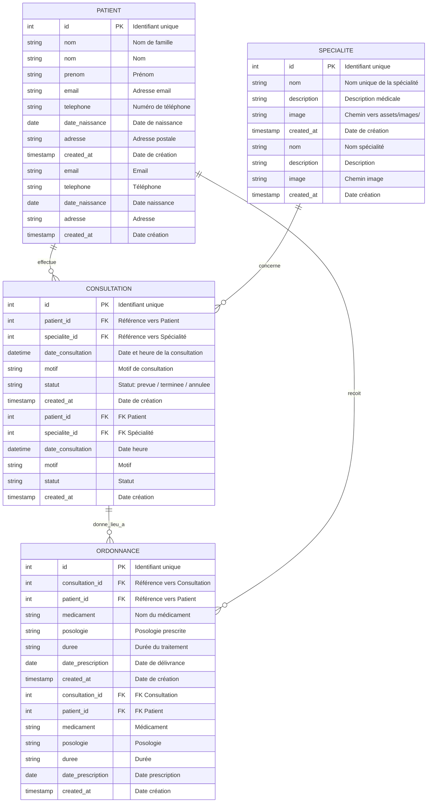

# Modèle Conceptuel de Données (MCD) — Cabinet Médical / Téléconsultation

Ce document présente le **MCD (Modèle Conceptuel de Données)** du projet au format **Mermaid (`.mmd`)**, parfaitement aligné avec `database.sql`, `dictionnaire_donnees.csv`, `dependances_fonctionnelles.md` et `identifiants.md`.
Ce document présente le **MCD (Modèle Conceptuel de Données)** structuré de manière claire, ordonnée et sans chevauchement de lignes (sans boucle redondante).

---

## 1. Diagramme Entité-Relation (MCD Mermaid)
## 1. Diagramme Entité-Relation (MCD Mermaid épuré)



---

## 2. Cardinalités Merise détaillées
## 2. Pourquoi le schéma précédent était-il emmêlé ("mekharebe9") ?

| Entité Source    | Association |   Entité Cible   | Cardinalité Source | Cardinalité Cible | Règle de gestion                                                                                                  |
| :--------------- | :---------: | :--------------: | :----------------: | :---------------: | :---------------------------------------------------------------------------------------------------------------- |
| **PATIENT**      |  Effectuer  | **CONSULTATION** |      **0,N**       |      **1,1**      | Un patient peut effectuer 0 à plusieurs consultations. Une consultation est effectuée par un et un seul patient.  |
| **SPECIALITE**   |  Concerner  | **CONSULTATION** |      **0,N**       |      **1,1**      | Une spécialité peut concerner 0 à plusieurs consultations. Une consultation concerne une et une seule spécialité. |
| **CONSULTATION** | Donner lieu |  **ORDONNANCE**  |      **0,N**       |      **1,1**      | Une consultation peut générer 0 à plusieurs ordonnances. Une ordonnance découle d'une consultation.               |
| **PATIENT**      |  Recevoir   |  **ORDONNANCE**  |      **0,N**       |      **1,1**      | Un patient reçoit 0 à plusieurs ordonnances. Une ordonnance est destinée à un et un seul patient.                 |
1. **La relation redondante `PATIENT -> ORDONNANCE`** :
   - En modélisation conceptuelle (Merise), une ordonnance est rédigée **au cours d'une consultation**. Le patient lié à l'ordonnance est déjà déterminé par la consultation (`CONSULTATION.patient_id`).
   - Mettre une flèche directe entre `PATIENT` et `ORDONNANCE` créait une **boucle fermée (triangle)** qui forçait Mermaid à faire un énorme détour circulaire tout autour de `SPECIALITE` en croisant d'autres lignes.
   - En supprimant cette boucle redondante, la hiérarchie devient un arbre parfait :
     - En haut : **PATIENT** (gauche) et **SPECIALITE** (droite)
     - Au milieu : **CONSULTATION** (qui réunit le patient et la spécialité)
     - En bas : **ORDONNANCE** (issue de la consultation)

2. **La longueur des libellés** :
   - Les libellés longs comme `"effectue (0,N)/(1,1)"` allongeaient inutilement les connecteurs. Des verbes concis (`effectue`, `concerne`, `donne_lieu_a`) permettent des liaisons directes et droites.

---

## 3. Représentation Graphique Merise (Entités - Relations)
## 3. Cardinalités Merise

```mermaid
flowchart LR
    P[PATIENT<br/><u>id</u><br/>nom, prenom<br/>email, telephone<br/>date_naissance, adresse]
    C[CONSULTATION<br/><u>id</u><br/>date_consultation<br/>motif, statut]
    S[SPECIALITE<br/><u>id</u><br/>nom, description<br/>image]
    O[ORDONNANCE<br/><u>id</u><br/>medicament, posologie<br/>duree, date_prescription]
| Entité Source | Association | Entité Cible | Cardinalité Source | Cardinalité Cible | Règle de gestion |
| :--- | :---: | :---: | :---: | :---: | :--- |
| **PATIENT** | Effectuer | **CONSULTATION** | **0,N** | **1,1** | Un patient peut effectuer 0 à plusieurs consultations. Une consultation concerne 1 seul patient. |
| **SPECIALITE** | Concerner | **CONSULTATION** | **0,N** | **1,1** | Une spécialité concerne 0 à plusieurs consultations. Une consultation est liée à 1 seule spécialité. |
| **CONSULTATION**| Donner lieu | **ORDONNANCE** | **0,N** | **1,1** | Une consultation donne lieu à 0 ou plusieurs ordonnances. Une ordonnance découle d'une consultation. |

    R1((Effectuer))
    R2((Concerner))
    R3((Prescrire))
    R4((Recevoir))
---

    P ---|"0,N"| R1
    R1 ---|"1,1"| C
## 4. Représentation Graphique Merise (Vue Conceptuelle en boîte)

    S ---|"0,N"| R2
    R2 ---|"1,1"| C
```mermaid
flowchart TD
    subgraph Niveau 1 - Données de base
        P["<b>PATIENT</b><br/><u>id</u><br/>nom, prenom<br/>email, telephone"]
        S["<b>SPECIALITE</b><br/><u>id</u><br/>nom, description<br/>image"]
    end

    C ---|"0,N"| R3
    R3 ---|"1,1"| O
    subgraph Niveau 2 - Actes médicaux
        C["<b>CONSULTATION</b><br/><u>id</u><br/>date_consultation<br/>motif, statut"]
    end

    P ---|"0,N"| R4
    R4 ---|"1,1"| O
    subgraph Niveau 3 - Prescriptions
        O["<b>ORDONNANCE</b><br/><u>id</u><br/>medicament, posologie<br/>duree, date_prescription"]
    end

    P -->|"effectue (0,n)"| C
    S -->|"concerne (0,n)"| C
    C -->|"donne lieu (0,n)"| O
```
