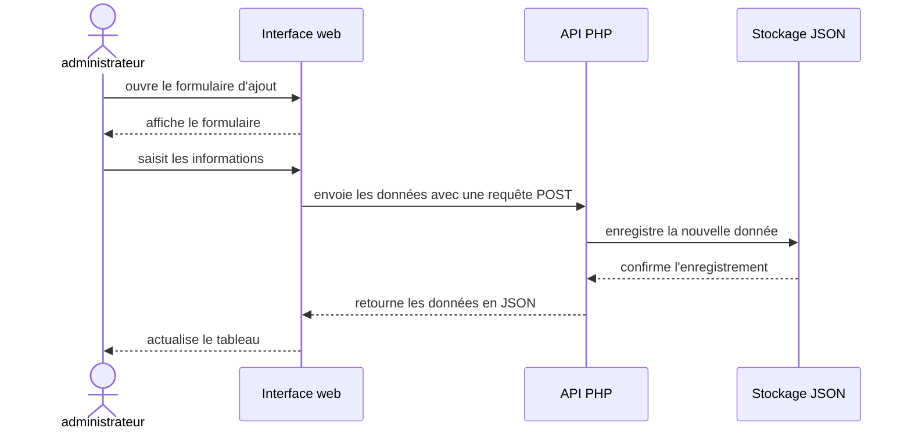
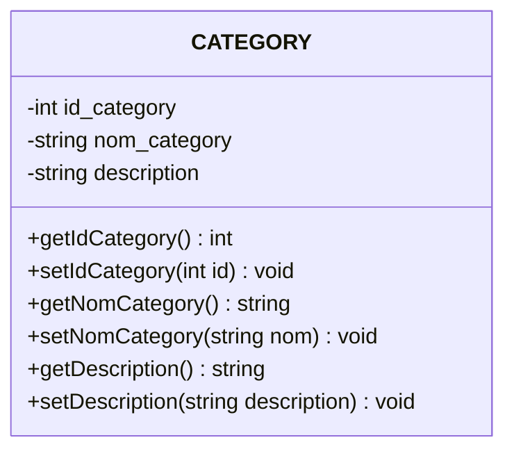

# Prompt — Cabinet Médical / Téléconsultation


---

## Rôle

Agis comme un développeur web chargé de réaliser le projet directement dans le workspace. Travaille de façon autonome et ne demande pas une validation après chaque étape.

## Contexte

Le projet est une application de gestion de **Cabinet Médical / Téléconsultation**. Ce prompt sera utilisé dans un dossier de travail vide, indépendant et sans lien avec le dossier où se trouve le prototype. N’assume pas que le prototype est présent ou accessible et ne recherche pas de fichiers en dehors du workspace actuel. Suis les consignes, la structure et les exemples intégrés à ce prompt. Si l’utilisateur fournit le prototype dans le workspace, tu peux l’examiner comme référence de simplicité et de style. N’utilise aucun chemin absolu propre à une machine.

Réalise le projet à partir des consignes, de la structure proposée et des exemples intégrés dans ce prompt. Ne bloque pas le travail et ne demande pas de chemin vers le prototype.

Réalise le projet dans le dossier de travail actuel, qui est vide. Ne crée pas un dossier `cabinet_medical` supplémentaire à l’intérieur : le dossier actuel est la racine du nouveau projet. Si un prototype est fourni dans ce workspace, laisse ses fichiers intacts.

## Objectif

Réalise un site fonctionnel comprenant un frontend et un dashboard backend qui permettent de gérer les quatre entités suivantes :

- **Consultation** : classe principale
- **Spécialité** : classe de classification
- **Ordonnance**
- **Patient**

Implémente le CRUD complet pour chaque entité : afficher, ajouter, modifier et supprimer.

## Modèle des données

Utilise le SQL ci-dessous comme référence pour les tables, les champs et les relations. Le SQL décrit le modèle des données uniquement : le projet doit réellement stocker les données dans des fichiers JSON via l’API PHP, sans base de données SQL.

```sql
CREATE DATABASE cabinet_medical
    CHARACTER SET utf8mb4
    COLLATE utf8mb4_unicode_ci;

USE cabinet_medical;

CREATE TABLE Specialite (
    id_specialite INT AUTO_INCREMENT PRIMARY KEY,
    nom_specialite VARCHAR(100) NOT NULL,
    description TEXT
);

CREATE TABLE Patient (
    id_patient INT AUTO_INCREMENT PRIMARY KEY,
    nom VARCHAR(100) NOT NULL,
    prenom VARCHAR(100) NOT NULL,
    date_naissance DATE,
    telephone VARCHAR(20),
    email VARCHAR(150)
);

CREATE TABLE Consultation (
    id_consultation INT AUTO_INCREMENT PRIMARY KEY,
    id_patient INT NOT NULL,
    id_specialite INT NOT NULL,
    date_heure DATETIME NOT NULL,
    motif TEXT NOT NULL,
    diagnostic TEXT,
    type_consultation ENUM('presentiel', 'teleconsultation')
        NOT NULL DEFAULT 'presentiel',
    statut ENUM('planifiee', 'terminee', 'annulee')
        NOT NULL DEFAULT 'planifiee',
    FOREIGN KEY (id_patient) REFERENCES Patient(id_patient),
    FOREIGN KEY (id_specialite) REFERENCES Specialite(id_specialite)
);

CREATE TABLE Ordonnance (
    id_ordonnance INT AUTO_INCREMENT PRIMARY KEY,
    id_consultation INT NOT NULL UNIQUE,
    date_creation DATE NOT NULL,
    contenu TEXT NOT NULL,
    recommandations TEXT,
    FOREIGN KEY (id_consultation) REFERENCES Consultation(id_consultation)
);
```

Relations à respecter dans les données JSON et dans l’application :

- Un patient peut avoir plusieurs consultations.
- Une spécialité peut être associée à plusieurs consultations.
- Une consultation peut avoir zéro ou une ordonnance.

## Technologies et style de code

- PHP et JavaScript.
- Programmation orientée objet (OOP).
- API PHP pour les opérations CRUD et la lecture/écriture des fichiers JSON.
- Tailwind CSS chargé dans les pages HTML avec :

  ```html
  <script src="https://cdn.tailwindcss.com"></script>
  ```

- Garde le code simple et proche du niveau et du style du prototype. Évite les solutions avancées qui ne sont pas nécessaires.
- Dans chaque fichier JavaScript, place le code qui utilise les éléments de la page dans `document.addEventListener("DOMContentLoaded", function () { ... })`.
- Déclare `API_URL` comme une URL complète, par exemple `http://localhost:8000/backend/admin/api/gestionPatient.php` lorsque le serveur PHP est lancé depuis la racine du nouveau projet, et non comme un chemin relatif commençant par `../`.
- Chaque méthode doit avoir une responsabilité unique. Par exemple, la méthode d’affichage affiche les données sans effectuer l’ajout, la modification ou la suppression.
- Chaque classe doit avoir une responsabilité claire. Ne mélange pas dans une même classe des responsabilités différentes sans nécessité.
- Garde des noms cohérents pour les fichiers, les classes, les méthodes et les propriétés.

## Design du frontend et du dashboard

- Si la skill `impeccable` est disponible dans l’environnement, utilise-la pour guider la conception UX/UI du frontend et du dashboard. Applique ses conseils de hiérarchie visuelle, de mise en page, de responsive design et d’accessibilité tout en respectant les règles de style et le niveau de simplicité précisés dans ce prompt.
- Si cette skill n’est pas disponible, continue la réalisation en suivant les consignes de design ci-dessous ; ne bloque pas le projet et ne demande pas de clarification uniquement pour cette raison.
- Réalise aussi le design des pages frontend et du dashboard ; ne livre pas uniquement des formulaires ou des tableaux sans mise en page.
- Inspire-toi de la présentation du prototype : navigation latérale sombre, fond général gris clair, panneaux blancs et boutons ou accents orange.
- Garde une interface simple, claire et cohérente avec le prototype, adaptée à la gestion d’un cabinet médical. N’ajoute pas d’effets visuels complexes ni de fonctions qui ne sont pas demandées.
- Prévois une navigation visible entre Consultation, Spécialité, Ordonnance et Patient.
- Présente les données sous forme de tableaux lisibles et les formulaires avec des libellés clairs.
- Utilise Tailwind CSS pour la mise en page et assure-toi que les pages restent utilisables sur écran étroit et sur ordinateur.
- Fournis des retours visibles après les actions CRUD, ainsi que des états compréhensibles quand une liste est vide ou qu’une requête échoue.

## Structure des dossiers

Respecte cette structure simple, inspirée de celle du prototype :

```text
./
├── frontend/
│   ├── index.html
│   ├── pages/
│   │   ├── consultations.html
│   │   ├── specialites.html
│   │   ├── ordonnances.html
│   │   └── patients.html
│   └── js/
│       ├── consultations.js
│       ├── specialites.js
│       ├── ordonnances.js
│       └── patients.js
├── backend/
│   ├── admin/
│   │   ├── api/
│   │   │   ├── gestionConsultation.php
│   │   │   ├── gestionSpecialite.php
│   │   │   ├── gestionOrdonnance.php
│   │   │   └── gestionPatient.php
│   │   └── class/
│   │       ├── Consultation.php
│   │       ├── Specialite.php
│   │       ├── Ordonnance.php
│   │       └── Patient.php
│   └── database/
│       ├── consultations.json
│       ├── specialites.json
│       ├── ordonnances.json
│       └── patients.json
└── conception/
    ├── diagram-use-case.mmd
    ├── diagram-sequence.mmd
    ├── diagram-context.mmd
    └── diagram-class.mmd
```

## Diagrammes Mermaid

Si l’utilisateur fournit le dossier du prototype dans le workspace, tu peux lire ses diagrammes dans son dossier `conception/` :

- `diagram-use-case.mmd`
- `diagram-sequence-add-category.mmd`
- `diagram-context.mmd`
- `diagram-class.mmd`

Utilise-les comme exemples de syntaxe Mermaid, de format et de niveau de détail. Crée les diagrammes correspondants pour le Cabinet Médical / Téléconsultation dans le dossier `conception/` à la racine du dossier de travail actuel. Adapte le contenu au nouveau projet, sans recopier les éléments propres à l’ancien sujet. Assure-toi que les diagrammes correspondent aux classes, relations et fonctionnalités réellement présentes dans le code.

Voici des exemples de code Mermaid inspirés des diagrammes du prototype. Ils montrent les formats attendus ; adapte les acteurs, les entités et les actions au projet médical.

### Exemple use case

```mermaid
usecase-beta
direction LR
actor Administrateur
actor Organisateur
actor Visiteur

Administrateur --> "consulter les catégories"
Administrateur --> "ajouter une catégorie"
Administrateur --> "modifier une catégorie"
Administrateur --> "supprimer une catégorie"

Organisateur --> "créer un événement"
Visiteur --> "consulter les événements"
```

### Exemple sequence



### Exemple context

```mermaid
usecase-beta
direction LR
actor Administrateur
actor Organisateur
actor Visiteur

system ["Billetterie d'événements"]

Administrateur -- Gère les événements et les catégories -- system
Organisateur -- Crée et gère ses événements -- system
Visiteur -- Consulte les événements et réserve des billets -- system
```

### Exemple class diagram



Ces exemples sont des modèles de syntaxe et de présentation. Ne conserve pas le domaine de la billetterie dans les nouveaux diagrammes : remplace-le par les acteurs, classes et échanges du Cabinet Médical / Téléconsultation.

## Règles de réalisation

- Réalise les fichiers directement à la racine du dossier de travail actuel, là où ce prompt est placé.
- N’altère et ne supprime aucun fichier du prototype.
- Reste dans le périmètre décrit ; n’ajoute pas de fonctionnalités de ta propre initiative.
- Ne remplace pas le stockage JSON par une base SQL.
- Construis le projet avec un code simple et compréhensible, dans le style du prototype.
- À la fin, résume les fichiers créés et indique comment lancer le site localement. Je lancerai le site et je testerai moi-même le résultat.

---
